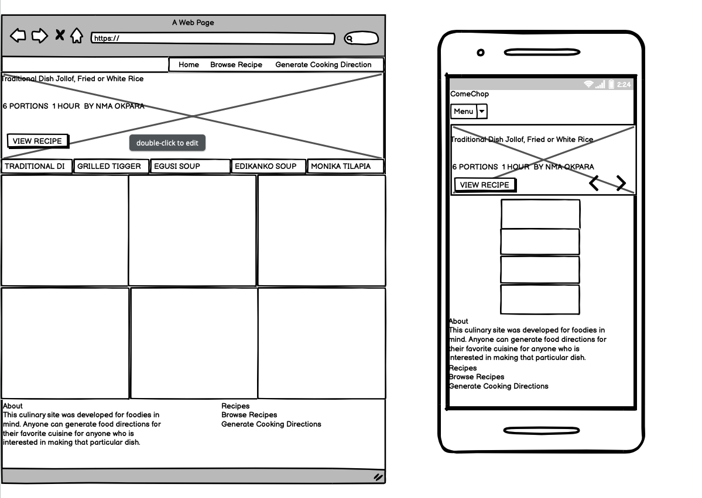
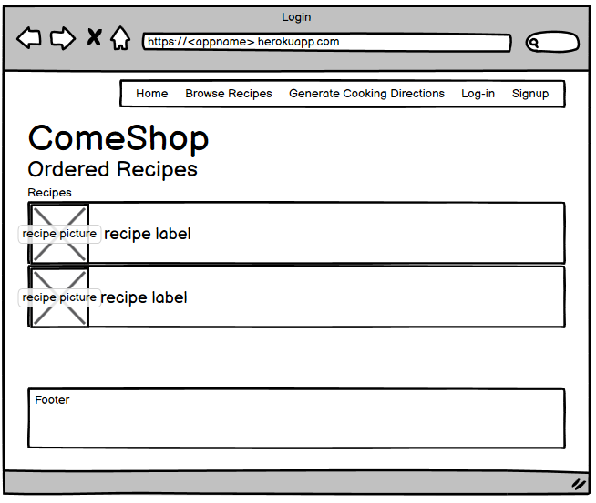
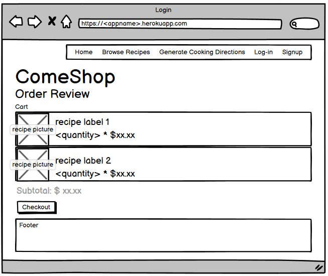
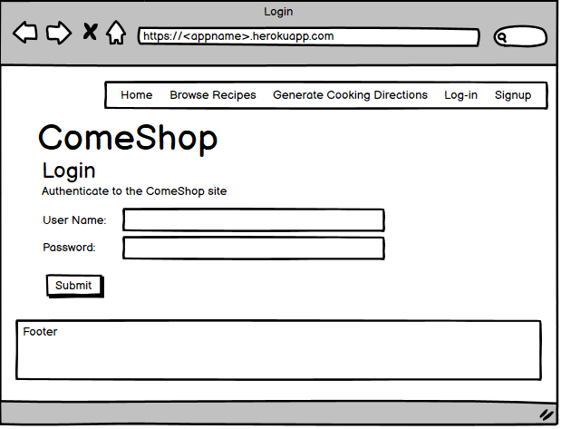
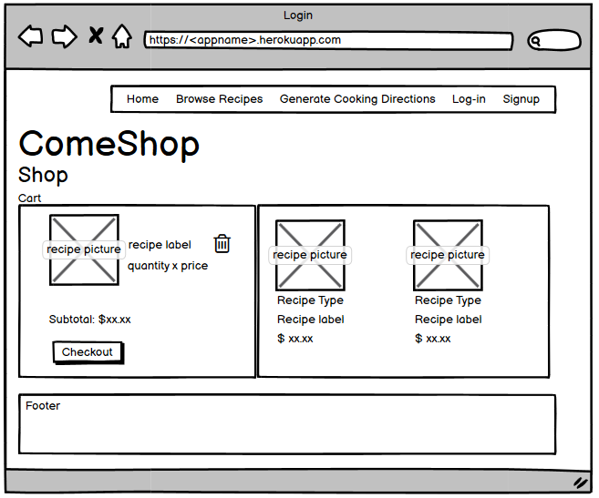

# Anthony Aneke's Code Institute Django Fullstack Development File Milestone Project

## Introduction
The final django milestone project is to build a full-stack site based around business logic used to control a centrally-owned dataset. The site is know as ComeShop Ecommerce Site (CES). As part of this project, I setup authentication mechanism and provide stripe paid access to the site's data and/or other activities based on the dataset, such as the purchase of the recipe.

## Value provided:
By implementing an authentication mechanism on the site as well as payment for the recipes, web customers can advance their own goals. 
As site owner, It will be able to generate revenue from the sale of the recipes to the web customers. There is no way for the web customers to bypass the site's mechanisms and derive all of the value available to paid users without paying.

I created a culinary full stack site that allows users to share data with the community, and benefit from having convenient access to the data provided by other members.
I have created a site that provides functionality, for any user. The site allows me the site owner to benefit from the collection of the dataset as a whole.

## Project Purpose
This full-stack culinary site was created for foodies in mind. The site allows users to manage a common dataset about a particular food domain where the user can generate food directions for their favorite cuisine for anyone who is interested in making that particular dish. The site is Unique, Viable in the real world and establishes a connection between the reader and the project to endear the reader to the project.

## Project Requirements
* Main Technologies
  * HTML, CSS, JavaScript, Python+Django
  * HTML: Used to implment web pages.
  * CSS:  Leveraged CSS and Bootstrap for Web and mobile first user experience.
  * JavaScript: Used javascript and jQuery used to interaction of the webform i..e CREATE, READ, UPDATE, DELETE (CRUD) calls,         input field validation,           RESTful request (from the browser to the application server).
  * Relational database (recommending MySQL or Postgres): The MySQL relational database is the system of record for CES data. The     data includes recipe information, recipe orders and user credentials. The MySQL    
    database will not hold any credit card or personal information. 
  * Stripe payments: Sending and Receiving Data from Stripe Payment. The interface of Stripe is made available via a REST API. For     security, the private key of     the credentials is stored in environment variables on the Heroku platform. The public key is embedded in the application and passed to the Stripe interface         invocation.
  * Additional libraries and APIs: All libraries and API aforementioned above.

## Mandatory Requirements
1.	CES Django Full Stack website developed with a MYSQL backend by a relational database that allows the web customer to store and manipulate data records about a culinary domain.
2.	Multiple Apps: The CES website has multiple apps. An app for each potentially reusable components. They are as follows: 
* login
* static pages
* recipe (CRUD)
* recipe_cart
* recipe orders
* recipe payment

3.	Data Modeling: Refer to Section 7.6_ Entity Relationship Diagram in the Software Architecture Document.
4.	User Authentication: The recipe card is persisted via Django sessions. Web customers of the CES have to log-in for recipe orders to get access to the cart. The recipe cart persist throughout the navigation of the CES as long as the user does not log off.
5.	User Interaction: CES satisifies this requirement. 
6.	Use of Stripe: The integration of Stripe was implemented to process Payment. The interface of Stripe is made available via a REST API. For security, the private key of the credentials is stored in environment variables on the Heroku platform. The public key is embedded in the application and passed to the Stripe interface invocation. The Stripe interface specification of callbacks allow the Stripe system to return control back to CES. Once the Stripe authentication is setup on the client via JavaScript, control is passed on to Stripe for the collection of payment information and its submission. Upon success, the Stripe registered callback is invoked returning control back to CES for the display of the payment success and/or confirmation page.
7.	Structure and Navigation: This CES website design navigation links work correctly. The navigation bar was made sticky using CSS3 offering the options to stick to the top of the page as you scroll down. This sticky property worked in accordance to design when it was tested on both chrome and safari. 
8.	Use of JavaScript: Used javascript and jQuery used to interaction of the webform i..e CREATE, READ, UPDATE, DELETE (CRUD) calls, input field validation, RESTful    request (from the browser to the application server).
9.	Documentation: The readme file incorporates all the desired components of documentation along with competent formatting and use of markdown and it includes user stories and linked wireframes.
10.	Information Architecture: This CES website meets the standard structural and behavioral design criteria and is presented in an organized routine. Please refer to project goals and user stories.
11.	Version Control: Use Git & GitHub for version control was used. I incrementally and iteratively staged, committed, and pushed new or modified all changes during the implementation of this website/ Version control can make use of atomic commits and descriptive commit messages. To see iterative modifications and changes, see Git Hub.
12.	Attribution: Reference are all below
13.	Deployment: Deployment was implemented using Heroku. The deployment write-up can integrate the steps taken to deploy the CES with steps needed for local development.

# Deployment Instructions

The application is deployed to the Heroku platform. To proceed with the deployment follow
the following steps:

1. Log-in to the Heroku console: www.heroku.com

2. Click on the *Create new app* button

3. In the *App name* field type the name of the application. For this application type:
   *fullstackane*
   
4. Click on the *Deploy* tab on the Heroku dashboard

5. On the *Deployment method* section of the page, click the *GitHub - Connect to GitHub*

6. On the *Connect to GitHub* section click on the **Connect to GitHub** button

7. Tyoe the name of the repo "Djangomilestoneproject" - click on search and then click connect

8. On the pop-up windows that shows up for authorization, click on the **Authorize Heroku**
   button

9. On the GitHub password prompt, type the GitHub account credential password

10. On the Heroku dashboard, go to the *Connect to GitHub* section and type the GitHub repository name then
    click the **Search** button

11. On the repository information show right below the **Search** button, click on the **Connect** button

12. On the *Automatic Deploys* section select the *master* branch as the **Choose a branch to deploy** field selection

13. Leave the *Wait for CI to pass before deploy* unchecked

14. Click on the **Enable Automatic Deploys** button

15. Navigate to the *Settings* tab, then scroll down to the *Config Vars* section

16. Click on **Reveal Config Vars**

17. On the *Key* field enter`DJANGO_SECRET_KEY`

18. On the *Value* field enter secret key, then click on the **Add** button

# MySQL relational database deployment

The Heroku platform provides *Add-ons* that allow the application consumption of third-party services. The 
**JawsDB** add-on was used to deploy the application's MySQL relational database instance.

To deploy the add-on follow these steps:

1. On the Heroku dashboard click on the *Resources* tab

2. In the *Add-ons* text field type *MySQL*

3. From the list of suggested options on the text field select the **JawsDB MySQL** service

4. On the popup window for the **JawsDB MySQL** service order form select the *Kitefin Shared - Free* for the 
   *Plan name*

5. Click on the **Submit Order Form**

6. The **JawsDB MySQL** service appears in the Add-ons section, click on the open icon of the service to open JawsDB
   MySQL console
   
7. On the **JawsDB MySQL** console, take note of the following field values: Connection String, Host, Username, Password
   and Database

8. On the Heroku dashboard, navigate to the *Settings* tab, then scroll down to the *Config Vars* section

9. Click on **Reveal Config Vars**

10. On the *Key* field enter`DATABASE_URL`

11. On the *Value* field enter the database url obtained from the **JawsDB MySQL** console *Connection String*, then 
    click on the **Add** button
    
# Stripe integration deployment

The Stripe payment integration requires both configuration on the Stripe console, and the Heroku platform to store 
and protect API secret keys.

To setup the Stripe payment follow these steps:

1. Go to www.stripe.com on your web browser

2. Click on the Sign-up link

3. Enter your preferred credentials for username and password

4. Provide your personal information: name, address and bank account information. It is important to note that
   the required API secret keys needed to integrate with the service will not be available until all the information
   is provided
   
5. Navigate to https://dashboard.stripe.com/test/apikeys, click on the `Reveal test key`. Notice that for production
   this key will be different. As this site is for testing purposes, click on this button to reveal the test key.
   
6. Click on the secret key to copy it to the clipboard
   
7. Open the Heroku console and navigate to the *Settings* tab, then scroll down to the *Config Vars* section

8. Click on the "Reveal Config Vars" button

9. On the *Key* field enter`STRIPE_API_KEY`

10. On the *Value* field paste the secret key from Stripe copied to the clipboard, then click on the **Add** button

11. Open the following file to provide the Stripe API public key: `static/scripts/recipe_stripe.js`

12. On the Stripe dashboard obtain the public API access key. Navigate to  `https://dashboard.stripe.com/test/apikey`
    then on the publishable API key click on the key to copy it to the clipboard.
    
13. Paste the public key to the parameter of the `Stripe()` object in `static/scripts/recipe_stripe.js`

14. Redeploy the application to the Heroku platform. (e.g. commit, push to Git and deploy application in Heroku)

15.	Security: Make sure to not include any passwords or secret keys in the project repository. Make sure to turn off the Django DEBUG mode, which could expose secrets.

Find wireframe from link below:
***Do remember the the Django full stack CES is a evloution from the Datacentric mileston project. Important to alss note, no authentication was expected for Datacentric project. The focus was on the data, rather than any business logic, hence this feature was not implemented.***

Find wireframe from link below:

## ComeChop Ordered recipes

## ComeChop order review

## ComeChop Login Wireframe

## ComeChop cart Wireframe-

User Stories: Refer to Software Architecture Document 

Layout and Visual Impact: Responsive Design – I used CSS to enable automated adjustments of screen sizes for multiple devices. I tested the site response in multiple simulated devices (tablets and mobile) and the site responded by adjusting its layout to the simulated screen sizes. Navbar on tablet resolutions was implemented in a similar fashion to Desktop for swift navigation.
Image Presentation - This website renders images, true to form and not small or stretched in anyway and meets the standard structural and behavioral design criteria and is presented in an organized routine.
Colour scheme and typography – The colour scheme on the website is consistent and does not hinder readability in any way. Primary action buttons have the same colour theme with the website.
Software Development practices: 

Testing implementation
I setup the Heroku platform to deploy the application and utilized the user stores and user cases as my test cases for the CES website. I performed static testing and visual inspection to make sure content was rendered as designed, I executed system testing to make sure user stories worked in accordance to design intent. I used online html validators from w3.org for source code testing. The testing write-up leveraged user stories and as expected there were defects found during the testing cycle. Used the following validator site: https://validator.w3.org/

Here are the test results:

Jollof Rice details page
Warning: Section lacks heading. Consider using h2-h6 elements to add identifying headings to all sections.

From line 95, column 3; to line 95, column 55

ils --><section class="recipe-details" itemprop="nutrition">
Grilled Tiger Prawns details page
Warning: Section lacks heading. Consider using h2-h6 elements to add identifying headings to all sections.

From line 95, column 3; to line 95, column 55

ils --><section class="recipe-details" itemprop="nutrition">
Nigerian Egusi Soup details page
Warning: Section lacks heading. Consider using h2-h6 elements to add identifying headings to all sections.

From line 95, column 3; to line 95, column 55

ils --><section class="recipe-details" itemprop="nutrition">
Edikanikong details page
Warning: Section lacks heading. Consider using h2-h6 elements to add identifying headings to all sections.
 
## Login Page
Error: No space between attributes.
At line 114, column 45 <td class=""label><label fo

Error: Attribute label not allowed on element td at this point.
From line 113, column 58; to line 114, column 50
nts-cont"><td class=""label><label

Attributes for element td:
Global attributes
colspan — Number of columns that the cell is to span
rowspan — Number of rows that the cell is to span
headers — The header cells for this cell

Error: Stray end tag div.
From line 137, column 1; to line 137, column 6
>

↩<!-- 
    
Attributes for element select:
Global attributes
autocomplete — Hint for form autofill feature
disabled — Whether the form control is disabled
form — Associates the element with a form element
multiple — Whether to allow multiple values
name — Name of the element to use for form submission and in the form.elements API
required — Whether the control is required for form submission
size — Size of the control
Warning: The type attribute is unnecessary for JavaScript resources.

From line 286, column 1; to line 286, column 75

rver.--><script type="text/javascript" src="/static/scripts/jquery.sceditor.js"></scri

Warning: The type attribute is unnecessary for JavaScript resources.

From line 337, column 1; to line 337, column 68

STFul --><script type="text/javascript" src="/static/scripts/recipe_rest.js"></scri

Error: The value of the for attribute of the label element must be the ID of a non-hidden form control.

From line 240, column 24; to line 240, column 38

s="label"><label for="5">Calori
Testing write-up
I tested all the links to make sure there was no broken links. Visual inspection was executed for typos and a proper display of html elements. System Test was executing to make sure dropdown pages were rendered in accordance to design intent.

Readme file
The readme file incorporates all the desired components of documentation along with competent formatting and use of markdown and it includes user stories and linked wireframes.

Data store integration
The MongoDB database as a service offering from www.mongodb.com was used for this project. The offering includes a free tier that was used to deploy the no-SQL MongoDB database. For deployment, the mongodb.com online wizard was used to deploy the database to the AWS east region. A new user was created in addition to the administrator user for programmatic access. The URI for the service was then configured as an environment variable in Heroku that is in turn made available to the Python code that runs in the Heroku platform. The URI is then used to authenticate via the Python pymongo library to the remote MongoDB service. The developed application sends AJAX requests from the Web browser client to the deployed application in Heroku. These requests are mapped to Python function via the Flask route definitions. The developed Python then receives and contructs the rich queries and invokes the MongoDB interface provided by the pymongo Python library. The MongoDB service data store contains information about recipes stored as documents. These documents contain the information that is displayed on the site for recipe details and photo images.

Deployment implementation
Deployment is working well on Heroku. The deployment write-up can integrate the steps taken to deploy the web-app with steps needed for local development.

Deployment write-up
The Heroku Platform as a Service offering was used to deploy the ComeChop application. To deploy the application on the Heroku platform follow these steps:

http://preview.themeforest.net/item/chow-recipes-food-html5-template/full_screen_preview/9711524?ref=phdev

Reference
805 Restaurant. [Online]. [Accessed 19 October 2020]. Available from: https://www.805restaurants.com/our-restaurants/hendon-central?view=menu

Themefroest. [Online]. [Accessed 2 October 2020]. Available from: http://preview.themeforest.net/item/chow-recipes-food-html5-template/full_screen_preview/9711524?ref=phdev

Nigerian Lazy Chef. [Online]. [Accessed 30 October 2020]. Available from: http://www.nigerianlazychef.com/2016/12/atadindin-fried-rice-jollof-fried-ricelazychef-christmas/

Chef Ola. [Online]. [Accessed 31 October 2020]. Available from: https://cheflolaskitchen.com/jollof-rice/

Nigerian Lazy Chef. [Online]. [Accessed 31 October 2020]. Available from: http://www.nigerianlazychef.com/author/nma/

Grilled Tiger Prawns with Chilli and garlic sauce. [Online]. [Accessed 31 October 2020]. Available from: https://www.yummly.com/recipe/Grilled-Prawns-1658835?prm-v1 Description, ingredients and instructions. . [Online]. [Accessed 3 November 2020]. Available from: https://www.yummly.com/recipe/Grilled-Prawns-1658835?prm-v1#directions

Paraibano Batista Image for Prawns and Chilli. [Online]. [Accessed 13 November 2020]. Available from: http://www.joaoalberto.com/2019/03/12/chef-paraibano-batista-e-destaque-no-festival-gastro-bom-de-mesa-desta-terca/

Vejario Abril. [Online]. [Accessed 14 November 2020]. https://vejario.abril.com.br/blog/beira-mar/batista-o-braco-direito-do-chef-claude-troisgros-serve-seu-primeiro-menu-degustacao-autoral-no-restaurante-do-patrao/

Preciouscore. [Online].[Accessed 17 November 2020]. Available from: https://www.preciouscore.com/egusi-soup/ Image, Description, Ingredients and Instructions obtained from: https://www.preciouscore.com/egusi-soup/

EDIKANOKONG SOUP. [Online].[Accessed 21 November 2020]. Available from: https://foodempire.com.ng/product/edikanikong-soup/

Foodempire. [Online]. [Accessed 22 November 2020]. Available from: https://foodempire.com.ng/product/edikanikong-soup/

Dooneyskitchen. [Online]. [Accessed 26 November 2020]. Available from: Ingredients and Instructions and author image from: http://dooneyskitchen.com/edikaikong-a-traditional-calabar-recipe/

Monika Tilapia. [Online]. [Accessed 3 December 2020]. Available from: Image From: https://www.africanvibes.com/best-african-summer-grilled-fish-recipes/ Ingredients, description, Instructions [Online]. [Accessed 3 - 5 December 2020]. Available from: https://www.africanvibes.com/best-african-summer-grilled-fish-recipes/

Chef Michael Smith. [Online]. [Accessed 26 December 2020]. Available from: https://www.cookthatbook.com/contact-us/interview-with-chef-michael-smith/

West African-Style Peanut Stew with Chicken. [Online]. [Accessed 26 December 2020]. Available from: https://www.allrecipes.com/recipe/276720/west-african-style-peanut-stew-with-chicken//

Moroccan Chicken with Saffron and Preserved Lemon Recipe Source. [Online]. [Accessed 27 December 2020]. https://www.allrecipes.com/recipe/246488/moroccan-chicken-with-saffron-and-preserved-lemon/

Moroccan Chickpea Stew Recipe Source. [Online]. [Accessed 27 December 2020]. https://www.allrecipes.com/recipe/217947/moroccan-chickpea-stew/#nutrition

Moroccan Lentil Soup Recipe Source [Online]. [Accessed 27 December 2020]. https://www.allrecipes.com/recipe/12960/moroccan-lentil-soup/#nutrition

Sweet and Nutty Moroccan Couscous [Online]. [Accessed 28 December 2020]. https://www.allrecipes.com/recipe/81551/sweet-and-nutty-moroccan-couscous/

Peri Peri African Chicken [Online]. [Accessed 28 December 2020]. https://www.allrecipes.com/recipe/72064/peri-peri-african-chicken/#nutrition

# Attached Software Architecture Document and Use Case Specification 
# 1.	Introduction
The ComeChop Ecommerce Site (CES) Software Architecture Document (SAD) provides a comprehensive architectural overview of the CES, using a number of different architectural views to depict different aspects of the CES.  It takes the use cases as the guiding source to come up with an CES architecture that satisfies the business and final project requirements.  
# 1.1	Purpose (Fill today)
